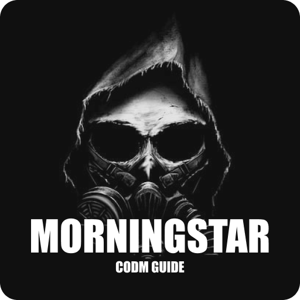

# Morningstar

  

> A database/guide kinda app for Call of Duty Mobile game.

### Features

* Soldiers
* Weapons
* Vehicles
* Comics
* Tier list builder
* Blueprints and camos

### Contributing

You can build and run the project by following these steps:

* Clone this repository
* Checkout the **develop** branch
* Run ``flutter pub get``
* Run ``flutter pub run build_runner build --delete-conflicting-outputs``
* Create a ``Secrets`` class in the infrastructure/telemetry folder and add a static property called ``appCenterKey`` (You could also comment out the related code)
